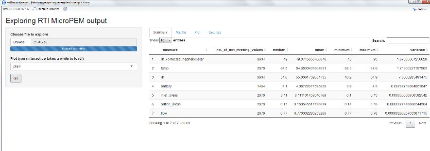
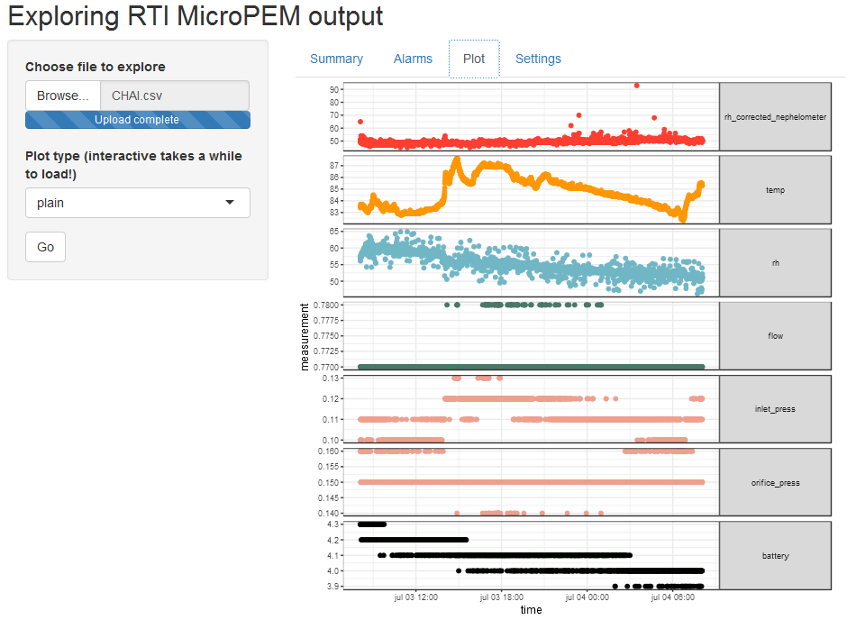
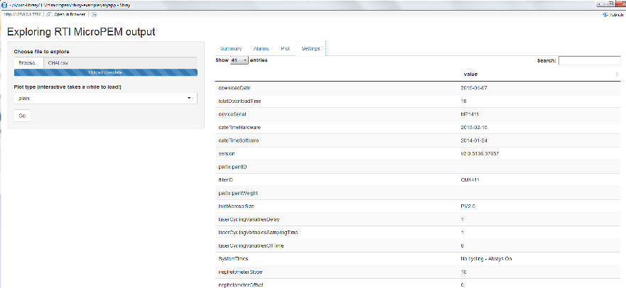

[](https://travis-ci.org/masalmon/ammon) [](https://ci.appveyor.com/project/masalmon/ammon) [](https://codecov.io/github/masalmon/ammon?branch=master)

Installation
============

``` r
library("devtools")
install_github("masalmon/ammon", build_vignettes=TRUE)
```

Introduction
============

This package aims at supporting the analysis of PM2.5 measures made with RTI MicroPEM. It is called ammon like Zeus Ammon (<https://en.wikipedia.org/wiki/Amun#Greece> ) because it helps us to Analyse Micropem MONitoring data in a very good, nearly godly, way.

The goal of the package functions is to get a time series of PM2.5 measures ready for analysis, with a good level of confidence in the measures. For this, the package provides a function for transforming the output of a RTI MicroPEM into an object of a S4 class called `MicroPEM`, functions for examining this information in order to look for possible problems in the data, and a function for cleaning the time series of PM2.5 based on the values of other variables such as relative humidity. The package moreover provides a Shiny app used for the field work of the CHAI project, but that could easily be adapted to other contexts. This vignette aims at providing an overview of the functionalities of the package.

From input data to `MicroPEM` objects
=====================================

The MicroPEM device outputs a csv file with all the information about the measures:

-   the measures themselves (relative humidity corrected nephelometer),

-   other measures that can help interpret them or check that no problem occured (temperature, relative humidity, battery, orifice pressure, inlet pressure, flow, accelerometer variables, reasons for shutdown, and variables related to user compliance),

-   a reminder of parameters set by the user (calibration parameters, frequency of measures)

-   and information about the device (filter ID, version of the software, etc). This is a lot of information, compiled in a handy csv format that is optimal for not loosing any data along the way, but not practical for analysis.

Therefore, the `ammon` package offers a S4 class called `MicroPEM` for storing the information, that will be easier to use by other functions. The class has slots with measures over time and a slot that is a list containing all the information located at the top of the MicroPEM output file, called `control`. Here is a picture of a RTI MicroPEM output file showing how the information is stored in the S4 class.


We will start by presenting the `control` slot.

`control` Slot
--------------

This slot is a list that includes 41 variabes:

-   `downloadDate` which is the date at which the files was downloaded from the device to a PC. It is a `POSIXt`.

-   `totalDownloadTime` gives the total download time, in seconds.

-   `deviceSerial` is the serial number of the device, which could be useful for e.g. finding a faulty device based on many output files.

-   `dateTimeHardware` indicates the date of release of the device. It is a `POSIXt`.

-   `dateTimeSoftware` indicates the date of release of the software used on the device. It is a `POSIXt`.

-   `version` indicates the version of the software.

-   `participantID` indicated the participantID, deduced either from the corresponding cell in the output file, or from the filename.

-   `filterID` is the ID number of the filter used for these measures.

-   `participantWeight` is a numeric variable.

-   `inletAerosolSize` is a factor variable, either "PM2.5" or "PM10". Please note that this variable does not provide confirmation that this aerosol size was measured, since it was chosen by hand by the person preparing the device for these measures. One could choose "PM2.5" and put the inlet for PM10, in which case PM10, not PM2.5, would be measured.

-   `laserCyclingVariablesDelay`

-   `laserCyclingVariablesSamplingTime`

-   `laserCyclingVariablesOffTime`

-   `SystemTimes` indicates whether the device was always on, or whether it was on/off, in which case the length of the on and off periods are given in seconds.

-   `nephelometerSlope`

-   `nephelometerOffset`

-   `nephelometerLogInterval` indicates how many seconds there are between measures of PM.

-   `temperatureSlope`

-   `temperatureOffset`

-   `temperatureLog` indicates how many seconds there are between measures of temperature.

-   `humiditySlope`

-   `humidityOffset`

-   `humidityLog` indicates how many seconds there are between measures of humidity.

-   `inletPressureSlope`

-   `inletPressureOffset`

-   `inletPressureLog` indicates how many seconds there are between measures of inlet pressure.

-   `inletPressureHighTarget`

-   `inletPressureLowTarget`

-   `orificePressureSlope`

-   `orificePressureOffset`

-   `orificePressureLog` indicates how many seconds there are between measures of orifice pressure.

-   `orificePressureHighTarget`

-   `orificePressureLowTarget`

-   `flowLog` indicates how many seconds there are between measures of flow.

-   `flowHighTarget`

-   `flowLowTarget`

-   `flowWhatIsThis`

-   `accelerometerLog`

-   `batteryLog` indicates how many seconds there are between measures of battery.

-   `ventilationSlope`

-   `ventilationOffset`

Time-varying measures
---------------------

Then there are 15 slots that are vectors of the same length:

-   `timeDate` is a `POSIXt` giving the date and time of each measure.

-   `temperature` is a numeric variable, in centigrade.

-   `relativeHumidity` is a proportion.

-   `battery`is a numeric variable.

-   `orifice pressure` and `inlet pressure` are numeric variables, in inches of water.

-   `flow` is a numeric variable, in liters per minute.

-   `xAxis`, `yAxis` and `zAxis` are accelerometer measures in three dimensions, with `vectorSum` being their sum.

-   `shutDownReason` is a factor variable indicating the reason for shutdown, in case a shutdown happened at this timepint.

-   `wearingCompliance` and `validityWearingCompliance` are respectively a logical and a character variables.

The `convertOutput` function.
-----------------------------

The `convertOutput` only takes two arguments as input: the path to the output file, and the version of the output file, either "CHAI" or "Columbia" (version with one blank line after each line with content). The result of a call to this function is an object of the class `MicroPEM`. Below is a example of a call to `convertOutput`.

``` r
library("ammon")
MicroPEMExample <- convertOutput(system.file("extdata", "dummyCHAI.csv", package = "ammon"),
version="CHAI")
class(MicroPEMExample)
```

    ## [1] "MicroPEM"
    ## attr(,"package")
    ## [1] "ammon"

Visualizing information contained in a `MicroPEM` object
========================================================

Plot method
-----------

The S4 `microPEM` class has its own plot method. It allows to draw a plot of all time-varying measures against the `timeDate` slot. It takes two arguments: the `MicroPEM` object to be plotted, and the type of plots to be produced, either a "plain" R plot with 6 facets, or a list of "rCharts" plots that can be either printed or saved afterwards -- the corresponding values of type are respectively "plain" and "rCharts".

Below we show to examples of uses of the plot method on a `MicroPE` object.

This is a "plain" plot. The results is pretty ugly but one would already be able to detect some problems such as outliers in nephelometer values or aberrant values of the flow so it does the job.

``` r
data("dummyMicroPEMChai")
par(mar=c(1,4,2,1))
plot(dummyMicroPEMChai, type="plain")
```


This is a nicer and interactive representation powered by rCharts but time is not rendered perfectly. It is to be used as visualization tool as well, not as a plot method for putting a nice figure in a paper.

``` r
plot_rCharts <- plot(dummyMicroPEMChai, type="rCharts")
#plot_rCharts[[1]]$print("chart", include_assets = TRUE)
```

`summaryTimeVarying` function
-----------------------------

Plotting the `MicroPEM` object is already a good way to notice any problem. Another function aims at providing more compact information about the time-varying measures. It is called `summaryTimeVarying` and outputs a table with summary statistics for each time-varying measures, except timeDate.

Below is an example of a call to this function.

``` r
library("xtable")
data("dummyMicroPEMChai")
results <- summaryTimeVarying(dummyMicroPEMChai)
print(xtable(results),  type = "html", include.rownames = FALSE, floating=FALSE)
```

<!-- html table generated in R 3.2.2 by xtable 1.8-0 package -->
<!-- Mon Jan 18 14:58:06 2016 -->
<table border="1">
<tr>
<th>
Measure
</th>
<th>
No. of non missing measures
</th>
<th>
Median
</th>
<th>
Mean
</th>
<th>
Minimum
</th>
<th>
Maximum
</th>
<th>
Variance
</th>
</tr>
<tr>
<td>
RH-corrected Nephelometer
</td>
<td align="right">
8634
</td>
<td align="right">
49.00
</td>
<td align="right">
49.37
</td>
<td align="right">
45.00
</td>
<td align="right">
93.00
</td>
<td align="right">
1.68
</td>
</tr>
<tr>
<td>
Temperature
</td>
<td align="right">
2878
</td>
<td align="right">
84.50
</td>
<td align="right">
84.68
</td>
<td align="right">
82.30
</td>
<td align="right">
87.60
</td>
<td align="right">
1.72
</td>
</tr>
<tr>
<td>
Relative humidity
</td>
<td align="right">
8634
</td>
<td align="right">
54.60
</td>
<td align="right">
55.01
</td>
<td align="right">
46.20
</td>
<td align="right">
64.90
</td>
<td align="right">
7.67
</td>
</tr>
<tr>
<td>
Inlet Pressure
</td>
<td align="right">
2878
</td>
<td align="right">
0.11
</td>
<td align="right">
0.11
</td>
<td align="right">
0.10
</td>
<td align="right">
0.13
</td>
<td align="right">
0.00
</td>
</tr>
<tr>
<td>
Orifice Pressure
</td>
<td align="right">
2878
</td>
<td align="right">
0.15
</td>
<td align="right">
0.15
</td>
<td align="right">
0.14
</td>
<td align="right">
0.16
</td>
<td align="right">
0.00
</td>
</tr>
<tr>
<td>
Flow
</td>
<td align="right">
2878
</td>
<td align="right">
0.77
</td>
<td align="right">
0.77
</td>
<td align="right">
0.77
</td>
<td align="right">
0.78
</td>
<td align="right">
0.00
</td>
</tr>
<tr>
<td>
Battery
</td>
<td align="right">
1464
</td>
<td align="right">
4.10
</td>
<td align="right">
4.09
</td>
<td align="right">
3.90
</td>
<td align="right">
4.30
</td>
<td align="right">
0.01
</td>
</tr>
</table>
`summarySettings` and `compareSettings` function
------------------------------------------------

When analysing the measures, one is also interesting into knowing if the parameters were set in a consistent way. Two functions off the `ammon` package allow to explore the upper part of an output MicroPEM file, that is, the settings. The first one is called `summarySettings` and simply outputs all elements of the `control` slot in a data table of the R package `dplyr`:

``` r
library("xtable")
data("dummyMicroPEMChai")
settings <- summarySettings(dummyMicroPEMChai)
print(xtable(settings),  type = "html", include.rownames = FALSE, floating=FALSE)
```

<!-- html table generated in R 3.2.2 by xtable 1.8-0 package -->
<!-- Mon Jan 18 14:58:06 2016 -->
<table border="1">
<tr>
<th>
parameterName
</th>
<th>
parameterValue
</th>
</tr>
<tr>
<td>
downloadDate
</td>
<td>
2015-07-04
</td>
</tr>
<tr>
<td>
totalDownloadTime
</td>
<td>
18
</td>
</tr>
<tr>
<td>
deviceSerial
</td>
<td>
MP1411
</td>
</tr>
<tr>
<td>
dateTimeHardware
</td>
<td>
2013-02-15
</td>
</tr>
<tr>
<td>
dateTimeSoftware
</td>
<td>
2014-01-24
</td>
</tr>
<tr>
<td>
version
</td>
<td>
v2.0.5136.37657
</td>
</tr>
<tr>
<td>
participantID
</td>
<td>
C:/Users/msalmon/Documents/R/win-library/3.2/ammon/extdata/dummyCHAI.csv
</td>
</tr>
<tr>
<td>
filterID
</td>
<td>
CM1411
</td>
</tr>
<tr>
<td>
participantWeight
</td>
<td>
</td>
</tr>
<tr>
<td>
inletAerosolSize
</td>
<td>
PM2.5
</td>
</tr>
<tr>
<td>
laserCyclingVariablesDelay
</td>
<td>
1
</td>
</tr>
<tr>
<td>
laserCyclingVariablesSamplingTime
</td>
<td>
1
</td>
</tr>
<tr>
<td>
laserCyclingVariablesOffTime
</td>
<td>
8
</td>
</tr>
<tr>
<td>
SystemTimes
</td>
<td>
No cycling - Always OnNA
</td>
</tr>
<tr>
<td>
nephelometerSlope
</td>
<td>
10.000
</td>
</tr>
<tr>
<td>
nephelometerOffset
</td>
<td>
0
</td>
</tr>
<tr>
<td>
nephelometerLogInterval
</td>
<td>
10
</td>
</tr>
<tr>
<td>
temperatureSlope
</td>
<td>
10.000
</td>
</tr>
<tr>
<td>
temperatureOffset
</td>
<td>
0
</td>
</tr>
<tr>
<td>
temperatureLog
</td>
<td>
30
</td>
</tr>
<tr>
<td>
humiditySlope
</td>
<td>
10.000
</td>
</tr>
<tr>
<td>
humidityOffset
</td>
<td>
0
</td>
</tr>
<tr>
<td>
humidityLog
</td>
<td>
10
</td>
</tr>
<tr>
<td>
inletPressureSlope
</td>
<td>
40.950.000
</td>
</tr>
<tr>
<td>
inletPressureOffset
</td>
<td>
0
</td>
</tr>
<tr>
<td>
inletPressureLog
</td>
<td>
30
</td>
</tr>
<tr>
<td>
inletPressureHighTarget
</td>
<td>
1280
</td>
</tr>
<tr>
<td>
inletPressureLowTarget
</td>
<td>
768
</td>
</tr>
<tr>
<td>
orificePressureSlope
</td>
<td>
40.950.000
</td>
</tr>
<tr>
<td>
orificePressureOffset
</td>
<td>
0
</td>
</tr>
<tr>
<td>
orificePressureLog
</td>
<td>
30
</td>
</tr>
<tr>
<td>
orificePressureHighTarget
</td>
<td>
2167
</td>
</tr>
<tr>
<td>
orificePressureLowTarget
</td>
<td>
1592
</td>
</tr>
<tr>
<td>
flowLog
</td>
<td>
30
</td>
</tr>
<tr>
<td>
flowHighTarget
</td>
<td>
900
</td>
</tr>
<tr>
<td>
flowLowTarget
</td>
<td>
200
</td>
</tr>
<tr>
<td>
flowWhatIsThis
</td>
<td>
0.5
</td>
</tr>
<tr>
<td>
accelerometerLog
</td>
<td>
5
</td>
</tr>
<tr>
<td>
batteryLog
</td>
<td>
60
</td>
</tr>
<tr>
<td>
ventilationSlope
</td>
<td>
</td>
</tr>
<tr>
<td>
ventilationOffset
</td>
<td>
</td>
</tr>
</table>
Then, in some cases, once one has collected several output files from RTI MicroPEM devices, before using the measures one would like to check that e.g. the nephelometer slope is the same for all measures. The `compareSettings` function answers this need. It takes two arguments as input: the directory in which all (and only) the output files are, and the version of this output files (either "CHAI" or "Columbia"). It outputs a data.frame with all parameters as columns, each file corresponding to a line.

ADD EXAMPLE LATER.

Shiny app developped for the CHAI project
-----------------------------------------

In the context of the CHAI project, we developped a Shiny app based on the previous functions, that allows to explore a MicroPEM output file. The app is called by the function `runShinyApp` with no argument. There is one side panel where one can choose the file to analyse. There are four tabs:

-   One with the output of a call to `summaryTimeVarying`,

-   One with the output of a call to the `alarmCHAI` function that performs a few checks specific to the CHAI project,

-   One with the output of a call to the plot method,

-   One with the output of a call to `summarySettings`.

This app allows the exploration of a MicroPEM output file with no R experience.

Below we show screenshots of the app.








Modifying a `microPEM` object
=============================

The `filterTimeDate` function
-----------------------------

One could be interested in only a part of the time-varying measures, e.g. the measures from the afternoon. Using the `filterTimeDate`function on a `MicroPEM` object, one can get a `MicroPEM` object with shorter slots for the time-varying variables, based on the values of `fromTime`and `untilTime` that should be `POSIXct`.

In the code below, we only keep measures from the first 12 hours of measures.

``` r
# load the lubridate package
library("lubridate")
# load the dummy MicroPEM object
data("dummyMicroPEMChai")
# print length of two slots
length(dummyMicroPEMChai@nephelometer)
```

    ## [1] 17279

``` r
length(dummyMicroPEMChai@temperature)
```

    ## [1] 17279

``` r
# command for only keeping measures from the first twelve hours
shorterMicroPEM <- filterTimeDate(MicroPEMObject=dummyMicroPEMChai,untilTime=NULL,
fromTime=min(dummyMicroPEMChai@timeDate, na.rm=TRUE) + hours(12))
# print length of two slots
length(shorterMicroPEM@nephelometer)
```

    ## [1] 8678

``` r
length(shorterMicroPEM@temperature)
```

    ## [1] 8678

The `cleaningMeasures` function
-------------------------------

For now, the `cleaningMeasures` function returns a data table of all the time varying measures (nephelometer, temperature, relative humidity, orifice pressure, inlet pressure and flow) where the nephelometer values are set to NA if the relative humidity at the same time is higher than 90% or if the values were negative.
