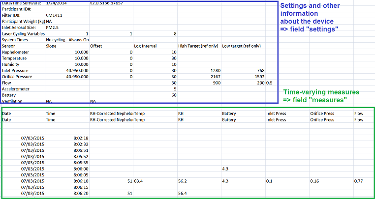

[](https://travis-ci.org/masalmon/ammon) [](https://ci.appveyor.com/project/masalmon/ammon) [](https://codecov.io/github/masalmon/ammon?branch=master)

Please note that this package is under development.

Installation
============

``` r
library("devtools")
install_github("masalmon/ammon", build_vignettes=TRUE)
```

Introduction
============

This package aims at supporting the analysis of PM2.5 measures made with RTI MicroPEM. It is called ammon like Zeus Ammon (<https://en.wikipedia.org/wiki/Amun#Greece> ).

The goal of the package functions is to help in two main tasks:

-   Checking individual MicroPEM output files after, say, one day of data collection.

-   Building a data base based on output files, and clean and transform the data for further analysis.

For the examination of individual files, the package provides a function for transforming the output of a RTI MicroPEM into an object of a R6 class called `micropem`, functions for examining this information in order to look for possible problems in the data. The package moreover provides a Shiny app used for the field work of the CHAI project, but that could easily be adapted to other contexts.

This document aims at providing an overview of the functionalities of the package.

Checking individual files: from input data to `micropem` objects
================================================================

The MicroPEM device outputs a csv file with all the information about the measures:

-   the measures themselves (relative humidity corrected nephelometer),

-   other measures that can help interpret them or check that no problem occured (temperature, relative humidity, battery, orifice pressure, inlet pressure, flow, accelerometer variables, reasons for shutdown, and variables related to user compliance),

-   a reminder of parameters set by the user (calibration parameters, frequency of measures)

-   and information about the device (filter ID, version of the software, etc). This is a lot of information, compiled in a handy csv format that is optimal for not loosing any data along the way, but not practical for analysis.

Therefore, the `ammon` package offers a R6 class called `micropem` for storing the information, that will be easier to use by other functions. The class has fields with measures over time and a field that is a list containing all the information located at the top of the MicroPEM output file, called `settings`. Here is a picture of a RTI MicroPEM output file showing how the information is stored in the R6 class.



We will start by presenting the `settings` field.

`settings` field
----------------

This field is a data.frame (dplyr tbl\_df) that includes 41 variables.

`measures` field
----------------

This field is a data.frame (dplyr tbl\_df) with the time-varying variables. \#\# The `convert_output` function.

The `convert_output` only takes one arguments as input: the path to the output file. The result of a call to this function is an object of the class `micropem`. Below is a example of a call to `convert_output`.

``` r
library("ammon")
micropem_example <- convert_output(system.file("extdata", "CHAI.csv", package = "ammon"))
class(micropem_example)
```

    ## [1] "micropem" "R6"

`filename` field
----------------

This field contains the full filename of the file that was used to generate the `micropem` object.

Visualizing information contained in a `micropem` object
--------------------------------------------------------

### Plot method

The R6 `micropem` class has its own plot method. It allows to draw a plot of all time-varying measures against the `timeDate` field. It takes two arguments: the `micropem` object to be plotted, and the type of plots to be produced, either a "plain" `ggplot2` plot with 6 facets, or its interactive version produced with the `ggiraph` package -- the corresponding values of type are respectively "plain" and "interactive".

Below we show to examples of uses of the plot method on a `micropem` object.

This is a "plain" plot.

``` r
data("micropemChai")
par(mar=c(1,4,2,1))
micropemChai$plot()
```


This is a nicer and interactive representation: you can look at what happens if you put your mouse over the time series. It is to be used as visualization tool as well, not as a plot method for putting a nice figure in a paper.

``` r
library("ggiraph")
p <- micropemChai$plot(type = "interactive")
ggiraph(code = {print(p)}, width = 10, height = 10)
```

### `summary` method

Plotting the `micropem` object is already a good way to notice any problem. Another methods aims at providing more compact information about the time-varying measures. It is called `summary` and outputs a table with summary statistics for each time-varying measures, except timeDate.

Below is an example of use of this method.

``` r
library("xtable")
data("micropemChai")
results <- micropemChai$summary()
results %>% knitr::kable()
```

| measure                     |  No. of not missing values|  Median|        Mean|  Minimum|  Maximum|   Variance|
|:----------------------------|--------------------------:|-------:|-----------:|--------:|--------:|----------:|
| rh\_corrected\_nephelometer |                       8634|   49.00|  49.3745657|    45.00|    93.00|  1.6780557|
| temp                        |                       2878|   84.50|  84.6830438|    82.30|    87.60|  1.7180023|
| rh                          |                       8634|   54.60|  55.0061733|    46.20|    64.90|  7.6665285|
| battery                     |                       1464|    4.10|   4.0872268|     3.90|     4.30|  0.0078272|
| inlet\_press                |                       2878|    0.11|   0.1111015|     0.10|     0.13|  0.0000538|
| orifice\_press              |                       2878|    0.15|   0.1505455|     0.14|     0.16|  0.0000072|
| flow                        |                       2878|    0.77|   0.7703023|     0.77|     0.78|  0.0000029|

### Shiny app developped for the CHAI project

In the context of the [CHAI project](http://www.chaiproject.org/), we developped a Shiny app based on the previous functions, that allows to explore a MicroPEM output file. The app is called by the function `run_shiny_app` with no argument. There is one side panel where one can choose the file to analyse. There are four tabs:

-   One with the output of a call to the `summary` method of the `micropem` object created,

-   One with the output of a call to the `alarmCHAI` function that performs a few checks specific to the CHAI project,

-   One with the output of a call to the plot method,

-   One with the output of a call to `summarySettings`.

This app allows the exploration of a MicroPEM output file with no R experience.

Below we show screenshots of the app.


From a bunch of output files to data ready for further analysis
===============================================================

The \`batch\_convert
